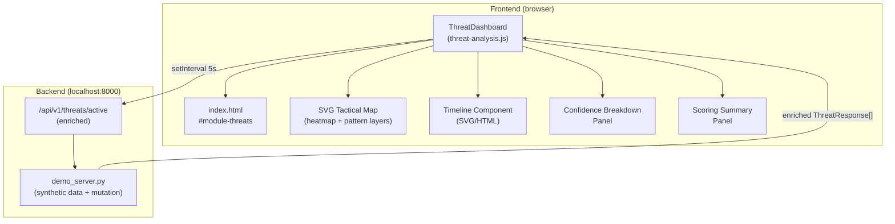

# Design Document: AI Threat Analysis Dashboard

## Overview

The AI Threat Analysis Dashboard enhances the existing AEGIS C4ISR Threat Detection module tab with real-time AI-driven threat scoring, pattern detection, confidence visualization, and historical timeline analysis. The feature is implemented entirely in plain HTML/CSS/JavaScript — no build system, no frameworks — and integrates with the existing FastAPI demo server running on `localhost:8000`.

The design extends two existing files:
- `frontend/index.html` — new HTML structure injected into the `#module-threats` section
- `frontend/app.js` (or a new `frontend/threat-analysis.js`) — polling logic, DOM manipulation, and data processing

The demo server (`demo_server.py`) gains new endpoints that return enriched threat data including confidence breakdowns, pattern groupings, and synthetic mutation on each poll.

### Key Design Decisions

- **Polling over WebSocket**: The requirements specify a 5-second polling interval. Given the no-framework constraint and the existing polling pattern already used in `app.js` for system health, `setInterval`-based polling is the natural fit. WebSocket would add complexity without a clear benefit at this scale.
- **SVG for heatmap and pattern connectors**: The tactical map is already an SVG element (`#tacticalMap`). Heatmap cells and pattern bounding polygons are added as SVG layers within the same element, keeping rendering consistent.
- **Module-scoped state object**: All dashboard state (last poll data, previous counts for trend indicators, selected threat, active time window) lives in a single `ThreatDashboard` object to avoid global variable sprawl.
- **Demo server enrichment**: Rather than a separate mock file, the demo server's `/api/v1/threats/active` endpoint is extended to return the full enriched schema. A server-side counter tracks poll cycles to simulate score mutation.

---

## Architecture



The `ThreatDashboard` class owns the polling loop and is the single source of truth for dashboard state. On each successful poll it:
1. Diffs the new threat list against the previous to detect additions and removals
2. Updates the threat list DOM (prepend new, remove resolved)
3. Recomputes pattern groups and updates the SVG pattern layer
4. Recomputes heatmap cell weights and updates the SVG heatmap layer
5. Appends new markers to the timeline
6. Recalculates summary panel metrics and trend indicators

---

## Components and Interfaces

### ThreatDashboard (threat-analysis.js)

The main controller class. Instantiated once when the threats module tab is activated.

```javascript
class ThreatDashboard {
    constructor(apiBaseURL)
    start()                          // begins polling loop
    stop()                           // clears interval
    _poll()                          // single poll cycle
    _diffThreats(prev, next)         // returns { added, removed, updated }
    _renderThreatList(threats, patterns)
    _renderPatternGroup(pattern, threats)
    _renderSummaryPanel(threats, patterns, prevThreats)
    _renderTimeline(threats, windowMinutes)
    _renderHeatmap(threats)
    _renderBreakdownPanel(threat)
    _computePatternGroups(threats)   // pure function
    _computeHeatmapWeights(threats)  // pure function
    _computeWeightedScore(breakdown) // pure function
    _getConfidenceColor(score)       // pure function → 'green'|'amber'|'red'
    _getTrendIndicator(prev, next)   // pure function → '↑'|'↓'|'—'
    _setFeedStatus(ok)
    _setDemoMode(isDemoMode)
}
```

### Polling Interface

```javascript
// GET /api/v1/threats/active
// Response: ThreatResponse[]
```

### Demo Server Endpoints (additions to demo_server.py)

```
GET /api/v1/threats/active   → EnrichedThreat[]  (replaces basic /threats/)
GET /api/v1/threats/patterns → ThreatPattern[]
```

---

## Data Models

### EnrichedThreat (backend response schema)

```json
{
  "threat_id": "THR-001",
  "threat_type": "VEHICLE",
  "severity": "CRITICAL",
  "lat": 34.0588,
  "lng": -118.2701,
  "sector": "3A",
  "ai_confidence": 0.94,
  "sensor_source": "RADAR-A",
  "status": "ACTIVE",
  "detected_at": "2026-03-17T13:00:00Z",
  "pattern_id": "PAT-001",
  "confidence_breakdown": {
    "radar_classification":   { "score": 0.96, "sensor": "RADAR-A" },
    "visual_recognition":     { "score": 0.91, "sensor": "CAM-3" },
    "behavioral_analysis":    { "score": 0.88, "sensor": "ANALYTICS" },
    "signal_intelligence":    { "score": null,  "sensor": "SIGINT-1" }
  }
}
```

`ai_confidence` is the weighted average of available sub-model scores:
- Radar Classification: weight 0.35
- Visual Recognition: weight 0.30
- Behavioral Analysis: weight 0.20
- Signal Intelligence: weight 0.15

When a sub-model score is `null` (sensor offline), it is excluded and the remaining weights are renormalized.

### ThreatPattern (backend response schema)

```json
{
  "pattern_id": "PAT-001",
  "pattern_name": "COORDINATED ARMOR ADVANCE",
  "threat_ids": ["THR-001", "THR-002"],
  "aggregate_confidence": 0.91,
  "contains_critical": true,
  "centroid_lat": 34.0570,
  "centroid_lng": -118.2650
}
```

### DashboardState (frontend in-memory)

```javascript
{
  threats: EnrichedThreat[],        // current active threats
  prevThreats: EnrichedThreat[],    // previous poll snapshot (for trend calc)
  patterns: ThreatPattern[],
  selectedThreatId: string | null,
  timeWindowMinutes: number,        // 15 | 30 | 60 | 240 | 1440
  heatmapVisible: boolean,
  feedOk: boolean,
  lastUpdated: Date | null,
  isDemoMode: boolean,
  pollCount: number                 // used by demo server for mutation
}
```

### Severity Weight Map

```javascript
const SEVERITY_WEIGHTS = { CRITICAL: 4, HIGH: 3, MEDIUM: 2, LOW: 1 };
```

### Confidence Color Thresholds

```javascript
// score >= 0.85 → 'green'  (var(--green))
// score >= 0.60 → 'amber'  (var(--amber))
// score <  0.60 → 'red'    (var(--red))
```

---

## Correctness Properties

*A property is a characteristic or behavior that should hold true across all valid executions of a system — essentially, a formal statement about what the system should do. Properties serve as the bridge between human-readable specifications and machine-verifiable correctness guarantees.*

### Property 1: Confidence color tier mapping

*For any* confidence score value, `_getConfidenceColor(score)` must return `'green'` when score ≥ 0.85, `'amber'` when 0.60 ≤ score < 0.85, and `'red'` when score < 0.60. No score in [0.0, 1.0] may produce an unrecognized color.

**Validates: Requirements 1.2, 1.3, 1.4**

---

### Property 2: Every rendered threat entry contains a confidence display

*For any* non-empty list of `EnrichedThreat` objects passed to `_renderThreatList`, every resulting threat DOM element must contain both a numeric percentage text node and a progress bar element with a `width` style reflecting the score.

**Validates: Requirements 1.1, 1.5**

---

### Property 3: Polling fires at the correct interval

*For any* duration T (in seconds), the number of times `_poll()` is invoked must equal `floor(T / 5)` ± 1 (accounting for timer drift). Verified by mocking `setInterval` and advancing fake timers.

**Validates: Requirements 2.1**

---

### Property 4: New threats are prepended; resolved threats are removed

*For any* pair of consecutive poll responses (prev, next), every threat ID present in next but not in prev must appear at the top of the rendered list, and every threat ID present in prev but absent from next must not appear in the rendered list.

**Validates: Requirements 2.2, 2.3**

---

### Property 5: Feed degraded / restored round trip

*For any* sequence of poll failures followed by a successful poll, the "FEED DEGRADED" indicator must be visible after each failure and absent after the successful poll.

**Validates: Requirements 2.4, 2.5**

---

### Property 6: Last updated timestamp advances on success

*For any* successful poll, the "LAST UPDATED" timestamp displayed must be greater than or equal to the timestamp displayed before that poll.

**Validates: Requirements 2.6**

---

### Property 7: Pattern grouping respects spatial and temporal proximity

*For any* set of threats, `_computePatternGroups(threats)` must place two threats in the same pattern if and only if they are within 5 km of each other AND within 15 minutes of each other. Threats outside either bound must not share a pattern.

**Validates: Requirements 3.1**

---

### Property 8: Pattern group renders required fields

*For any* `ThreatPattern` object, the rendered pattern group DOM element must contain the pattern name, member count equal to `threat_ids.length`, and the aggregate confidence score.

**Validates: Requirements 3.2**

---

### Property 9: Expanding a pattern group reveals member threats

*For any* pattern group in the collapsed state, triggering the expand action must make all member threat entries visible in the DOM.

**Validates: Requirements 3.3**

---

### Property 10: CRITICAL pattern gets red border

*For any* pattern where `contains_critical` is true, the rendered pattern group element must have the red-border CSS class applied. For any pattern where `contains_critical` is false, the red-border class must be absent.

**Validates: Requirements 3.5**

---

### Property 11: Patterns counter equals active pattern count

*For any* list of `ThreatPattern` objects, the "PATTERNS DETECTED" counter value in the header must equal the length of that list.

**Validates: Requirements 3.6**

---

### Property 12: Timeline filter excludes out-of-window threats

*For any* time window W (minutes) and any set of threats, the timeline must render markers only for threats whose `detected_at` timestamp falls within the last W minutes. Threats outside the window must produce no marker.

**Validates: Requirements 4.2**

---

### Property 13: Timeline marker color matches severity

*For any* threat rendered on the timeline, the marker's color class must match the threat's `severity` field using the same severity-to-color mapping as the threat list.

**Validates: Requirements 4.3**

---

### Property 14: Timeline tooltip contains all required fields

*For any* threat marker on the timeline, the tooltip data object produced by the hover handler must contain non-null values for `threat_id`, `threat_type`, `severity`, `ai_confidence`, and `detected_at`.

**Validates: Requirements 4.4**

---

### Property 15: New threats append to timeline without full re-render

*For any* new threat arriving in a poll, the timeline marker count must increase by exactly 1 (assuming the threat falls within the active time window), and existing markers must retain their positions.

**Validates: Requirements 4.5**

---

### Property 16: Heatmap cell weight computation

*For any* set of threats assigned to a grid cell, `_computeHeatmapWeights` must return a weight equal to the sum of `SEVERITY_WEIGHTS[threat.severity]` for all threats in that cell. An empty cell must return weight 0 (rendered at opacity 0).

**Validates: Requirements 5.2, 5.3**

---

### Property 17: High-weight cells render red at full opacity

*For any* heatmap cell with computed weight > 8, the cell's SVG element must have a red fill at opacity 1.0.

**Validates: Requirements 5.4**

---

### Property 18: Weighted confidence score computation

*For any* `confidence_breakdown` object, `_computeWeightedScore(breakdown)` must return the weighted average of all non-null sub-model scores using the specified weights (Radar=0.35, Visual=0.30, Behavioral=0.20, SIGINT=0.15), renormalized when sub-models are absent.

**Validates: Requirements 6.6**

---

### Property 19: Confidence breakdown panel contains all sub-model rows

*For any* `EnrichedThreat`, the rendered breakdown panel must contain exactly four rows (Radar Classification, Visual Recognition, Behavioral Analysis, Signal Intelligence), each with a label, a horizontal bar, a numeric percentage or "N/A", and a sensor source string.

**Validates: Requirements 6.2, 6.3, 6.4, 6.5**

---

### Property 20: Summary panel values match threat list state

*For any* list of active threats and patterns, the summary panel must display: total count = `threats.length`, per-severity counts summing to `threats.length`, average confidence = mean of all `ai_confidence` values, and pattern count = `patterns.length`.

**Validates: Requirements 7.1**

---

### Property 21: Trend indicators reflect count direction

*For any* pair of consecutive poll snapshots, `_getTrendIndicator(prevCount, nextCount)` must return `'↑'` when nextCount > prevCount, `'↓'` when nextCount < prevCount, and `'—'` when equal.

**Validates: Requirements 7.4**

---

### Property 22: AI HIGH CONFIDENCE badge visibility

*For any* list of active threats, the "AI HIGH CONFIDENCE" badge must be visible if and only if every threat in the list has `ai_confidence > 0.80`. An empty threat list must not show the badge.

**Validates: Requirements 7.5**

---

### Property 23: Demo mode score mutation stays within bounds

*For any* demo threat, after each polling cycle the new `ai_confidence` must differ from the previous value by at most 0.05, and the result must remain clamped to [0.0, 1.0].

**Validates: Requirements 8.3**

---

### Property 24: Demo threats include all required fields

*For any* threat returned by the demo server's `/api/v1/threats/active` endpoint, the response object must contain non-null `ai_confidence`, `confidence_breakdown`, and `pattern_id` fields.

**Validates: Requirements 8.1**

---

## Error Handling

| Scenario | Behavior |
|---|---|
| Poll fetch fails (network error / 5xx) | Set `feedOk = false`, show "FEED DEGRADED" banner, retain last known data |
| Poll returns 200 but empty array | Clear threat list, show "NO ACTIVE THREATS", update timestamp |
| `confidence_breakdown` sub-model score is `null` | Display "N/A" in breakdown panel; exclude from weighted average with renormalization |
| Threat has unknown `severity` value | Default to LOW weight (1) for heatmap; render amber confidence color |
| Timeline window selection produces no results | Display "NO THREAT ACTIVITY IN SELECTED WINDOW" message |
| Demo server not reachable | Fall back to static seed data embedded in `threat-analysis.js`; show "DEMO MODE (OFFLINE)" badge |
| Pattern grouping produces a single-member group | Suppress the group — patterns require ≥ 2 members per Requirement 3.1 |

---

## Testing Strategy

### Unit Tests

Unit tests cover pure functions and specific examples using a standard test runner (e.g., Jest or plain `<script type="module">` test harness, consistent with the no-build-system constraint).

Focus areas:
- `_getConfidenceColor(score)` — boundary values at 0.60 and 0.85
- `_computeWeightedScore(breakdown)` — full set, missing sub-models, all null
- `_computeHeatmapWeights(threats)` — empty cell, single threat, mixed severities, weight > 8
- `_getTrendIndicator(prev, next)` — increase, decrease, equal
- `_computePatternGroups(threats)` — specific examples: two threats 4km apart / 10min apart (same group), two threats 6km apart (different groups)
- Demo server endpoint — verify ≥ 5 threats returned, ≥ 2 patterns returned
- "FEED DEGRADED" banner appears on fetch failure (mock fetch)
- "AI HIGH CONFIDENCE" badge appears only when all scores > 0.80
- Timeline default window is 60 minutes
- Empty timeline window shows correct message

### Property-Based Tests

Property tests use **fast-check** (browser-compatible, no build required via CDN) with a minimum of **100 iterations per property**.

Each test is tagged with a comment in the format:
`// Feature: ai-threat-analysis-dashboard, Property N: <property_text>`

| Property | Test Description |
|---|---|
| P1 | Generate random scores in [0.0, 1.0]; verify color tier is always one of green/amber/red and matches the correct threshold |
| P2 | Generate random EnrichedThreat arrays; verify every rendered entry has percentage text and progress bar |
| P3 | Advance fake timer by random multiples of 5s; verify poll call count |
| P4 | Generate random prev/next threat ID sets; verify prepend and removal invariants |
| P5 | Generate random fail/succeed sequences; verify FEED DEGRADED visibility |
| P6 | Generate random successful polls; verify timestamp is non-decreasing |
| P7 | Generate random threat pairs with random lat/lng/time; verify grouping iff within 5km AND 15min |
| P8 | Generate random ThreatPattern objects; verify rendered group contains name, count, score |
| P9 | Generate random patterns; verify expand reveals all member threats |
| P10 | Generate patterns with/without CRITICAL threats; verify red-border class presence |
| P11 | Generate random pattern lists; verify counter equals list length |
| P12 | Generate random threats and time windows; verify only in-window threats appear |
| P13 | Generate random threats; verify timeline marker color matches severity |
| P14 | Generate random threats; verify tooltip data has all 5 required fields |
| P15 | Generate random new threats; verify timeline marker count increments by 1 |
| P16 | Generate random threat sets per cell; verify weight sum and zero-opacity for empty |
| P17 | Generate cells with weight > 8; verify red fill at opacity 1.0 |
| P18 | Generate random breakdown objects with some null scores; verify weighted average formula |
| P19 | Generate random EnrichedThreat objects; verify breakdown panel has all 4 rows with required fields |
| P20 | Generate random threat/pattern lists; verify all 4 summary panel values are correct |
| P21 | Generate random (prev, next) count pairs; verify trend indicator direction |
| P22 | Generate random threat lists; verify badge visibility matches all-above-0.80 predicate |
| P23 | Generate random starting scores; simulate N poll cycles; verify each delta ≤ 0.05 and score stays in [0.0, 1.0] |
| P24 | Call demo endpoint; verify every returned threat has required fields |
